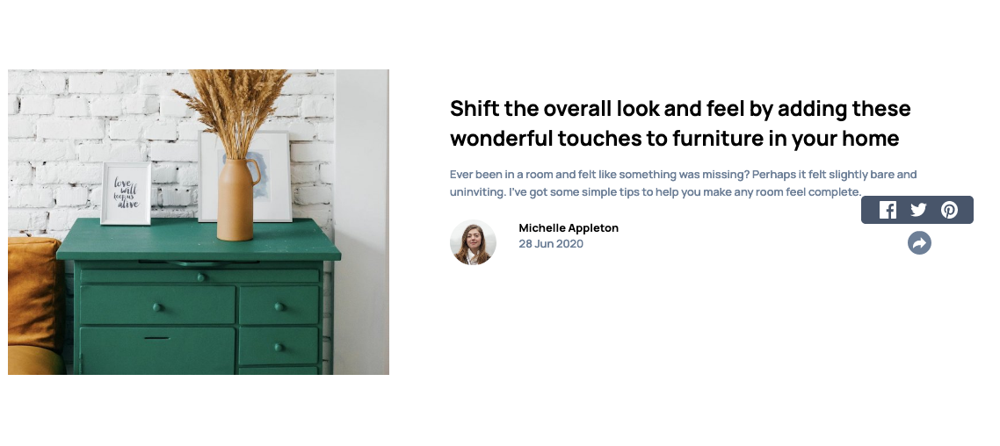

# Frontend Mentor - Article preview component solution

This is a solution to the [Article preview component challenge on Frontend Mentor](https://www.frontendmentor.io/challenges/article-preview-component-dYBN_pYFT).

## Table of contents

- [Overview](#overview)
  - [The challenge](#the-challenge)
  - [Screenshot](#screenshot)
  - [Links](#links)
- [My process](#my-process)
  - [Built with](#built-with)
  - [What I learned](#what-i-learned)
  - [Continued development](#continued-development)
  - [Useful resources](#useful-resources)
- [Author](#author)

## Overview

### The challenge

Users should be able to:

- View the optimal layout for the component depending on their device's screen size
- See the social media share links when they click the share icon

### Screenshot

### Links

- [Solution URL](https://github.com/geeky-amat/article-preview-component-master)
- [Live Site URL](https://geeky-amat.github.io/article-preview-component-master/)

## My process

### Built with

- Semantic HTML5 markup
- CSS custom properties
- Flexbox
- Mobile-first workflow
- [React](https://reactjs.org/) - JS library
- [Styled Components](https://styled-components.com/) - For styles

### What I learned

- `Vertical-align: top` doesn't seem to remove the space from the bottom in an anchor tag with text. As I recall the same used to work for images which I have even used elsewhere.

- I am not able to add a class name using `className="flex"` after I imported a React component. So, I need to do it before exporting the component. As I understand, the gets passed as a prop rather than simply giving that component a className.

- Learned to change the state of a parent component from an event handler on the child component by passing the handler function as a prop. For this I got help from a youtube video which is mentioned in the [Useful resources](#useful-resources).

- Learned that I can use 'unset' as the propery value for any property in `css` to restore the default property value of that property.

### Continued development

I can probably use `<ThemeProvider>` wrapper component to define global variable rather than defining them using JavaScript which I've done here.

### Useful resources

- [React Hooks Basics: How to change parent state from within a child component (useState) | 2020](https://www.youtube.com/watch?v=-N7auOijZts)

## Author

- Frontend Mentor - [@geeky-amat](https://www.frontendmentor.io/profile/geeky-amat)
- Twitter - [@GeekyAmat](https://www.twitter.com/GeekyAmat)